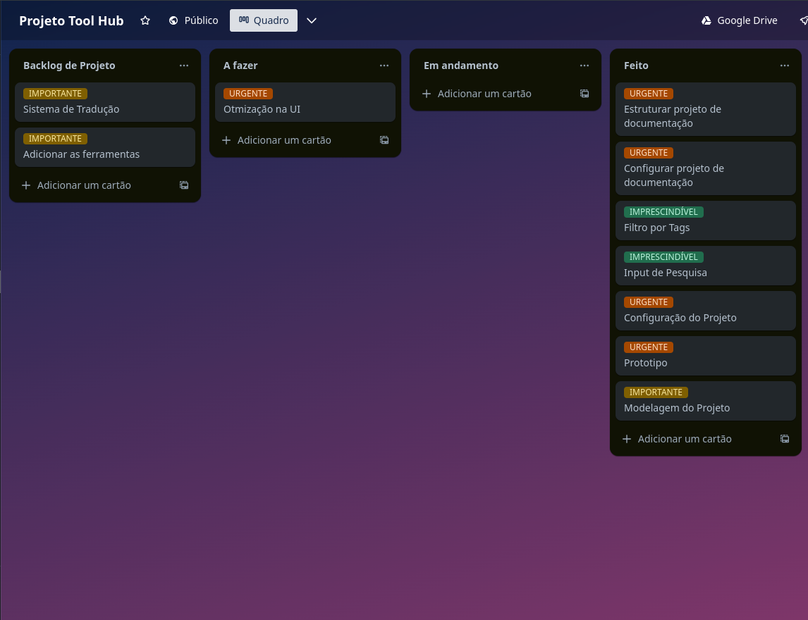

Este documento descreve o desenvolvimento de um sistema utilizando a metodologia **Scrum**. A equipe foi composta por alunos de **Unifacs** que trabalharam juntos para entregar um produto de alta qualidade de maneira iterativa e incremental.

## Equipe

- **Product Owner (PO)**: 
  - João Vitor Campos Gottschalk
- **Scrum Master**: 
  - Rilton Bispo dos Santos
- **Development Team**:
  - Eraldo de Oliveira Silva Neto
  - Lucas Davi Barros dos Santos
  - Matheus Silva de Oliveira
  - Marissa de Paula Oliveira Nascimento
  - Rafael José de Jesus Santana

## Metodologia Scrum

### Cerimônias usadas ao decorrer do projeto

##### Planejamento da Sprint
- **Frequência:** A cada duas semanas
- **Participantes:** Toda a equipe Scrum
- **Objetivo:** Definir o trabalho a ser realizado na próxima Sprint.

##### Daily Scrum
- **Frequência:** Diariamente
- **Participantes:** Toda a equipe de desenvolvimento
- **Objetivo:** Sincronizar as atividades e identificar impedimentos.

##### Revisão da Sprint
- **Frequência:** Ao final de cada Sprint
- **Participantes:** Toda a equipe Scrum e stakeholders
- **Objetivo:** Apresentar os incrementos realizados e obter feedback.

##### Retrospectiva da Sprint
- **Frequência:** Ao final de cada Sprint
- **Participantes:** Toda a equipe Scrum
- **Objetivo:** Refletir sobre o Sprint anterior e identificar melhorias para o próximo Sprint.

### Visão Geral
O projeto foi desenvolvido em ciclos de duas semanas, onde a equipe realizou todas as etapas do desenvolvimento ágil, desde o planejamento até a entrega de incrementos funcionais do sistema.

### Principais Funcionalidades Implementadas
Durante o desenvolvimento, a equipe trabalhou de acordo com as tarefas definidas no planejamento da Sprint. Utilizando o Trello como ferramenta para gerenciar as tarefas e registrar o progresso, cada membro teve suas atividades definidas. As atividades principais incluíram: 

1. Criação de Home da aplicação
2. Sistema de troca de tema
3. Configuração geral da aplicação
4. Design do sistema.
5. Busca de ferramentas
6. Filtro por `tag`

## Desafios e Lições Aprendidas 

### Desafios 

1. Implementação da Barra de Pesquisa: Criar um algoritmo de busca eficiente e rápido exigiu várias iterações e otimizações.

### Lições Aprendidas 

1. Importância do Planejamento: Planejar cada sprint foi de suma importância para o sucesso do projeto. 
2. Colaboração e Comunicação: Reuniões e transparência no progresso ajudaram a resolver impedimentos rapidamente.

## Ferramentas Utilizadas

- **Trello**: Utilizamos o Trello para gerenciar nosso backlog de histórias de usuário, organizar as tarefas em cada sprint e acompanhar o progresso do desenvolvimento.

---

## Conclusão
Através do planejamento cuidadoso, desenvolvimento colaborativo, revisão contínua e reflexão sobre o processo, características do ciclo de desenvolvimento incremental, a equipe conseguiu superar os desafios e conseguiu entregar um produto como esperado. O Trello e a metodologia utilizada permitiu que a gestão do projeto fosse eficiente.
